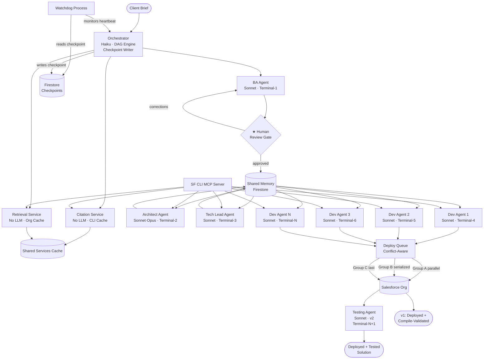

# SIID — Salesforce Intelligence Integrated Development

## Complete Multi-Agent Platform Architecture

### v2.2 — Second Review Pass

---

## Corrections from v2.0 Review (8 flaws fixed in v2.1)

| #   | Flaw                                      | Fix Applied                                              |
| --- | ----------------------------------------- | -------------------------------------------------------- |
| 1   | Orchestrator has no crash recovery        | Added Watchdog + DAG checkpoint/resume                   |
| 2   | Parallel deploys collide on same org      | Added metadata-type-aware Deploy Queue                   |
| 3   | Token math was optimistic / wrong         | Recalculated honestly with retry costs                   |
| 4   | Citation Agent was a cache, not an agent  | Renamed to Citation Service — no agentic loop            |
| 5   | Shared Memory write conflicts unaddressed | Added Firestore field-level write strategy               |
| 6   | BA Agent has no human review gate         | Added mandatory BA review gate before Architect fires    |
| 7   | Retrieval Agent had no spec               | Defined as Retrieval Service with full spec              |
| 8   | Testing Agent "FUTURE" gap not honest     | v1 scope is explicitly "deployed, not acceptance-tested" |

## Corrections from v2.1 Review (5 flaws fixed in v2.2)

| #   | Flaw                                            | Fix Applied                                                                               |
| --- | ----------------------------------------------- | ----------------------------------------------------------------------------------------- |
| 1   | Deploy Queue groups incomplete/wrong            | Added intra-group dep check, CustomMetadata, fixed Flow API name, added validation caveat |
| 2   | Watchdog can't distinguish crash from slow task | Task-aware heartbeat timeout + Firestore Orchestrator identity lock                       |
| 3   | BA review gate has no timeout or async handling | Persistent gate state, VS Code close handling, configurable idle timeout, pause/resume    |
| 4   | suggested_fix in debug payload is undocumented  | Explicit Fix Suggestion Generator step (Haiku call), added to token budget                |
| 5   | Group C blanket ordering is overly conservative | Per-task actual dependency classification replaces blanket metadata-type grouping         |

## Corrections from v2.2 Review (5 flaws fixed in v2.3)

| #   | Flaw                                             | Fix Applied                                                                                            |
| --- | ------------------------------------------------ | ------------------------------------------------------------------------------------------------------ |
| 1   | Watchdog lock has TOCTOU race condition          | Timeout computation moved inside Firestore transaction — atomic read+compute+acquire                   |
| 2   | Fix Suggestion Generator input too narrow        | Input expanded to error + terminal output + targeted task spec fields, tradeoff documented             |
| 3   | BA corrections loop is unbounded                 | Max 3 correction rounds, escalation message on limit, token budget for corrections phase               |
| 4   | Retrieval cache invalidation too coarse          | Replaced full-wipe with append-on-deploy + lazy re-fetch strategy                                      |
| 5   | No scratch org vs persistent org strategy stated | Org assumption documented, scratch org lifecycle defined, multi-project isolation flagged as known gap |

---

## 1. System Overview

SIID is a Salesforce services delivery platform. A client brief enters, a deployed Salesforce solution comes out — driven by specialized AI agents running in parallel, each with its own agentic loop.

**v1 honest scope:** Deployed, compile-validated, unit-tested Salesforce code.
Acceptance-criteria verification requires the Testing Agent (v2, see Section 3.5).

```
CLIENT BRIEF (Natural Language)
         │
         ▼
┌────────────────────────────────────────────────────────────────────┐
│                        ORCHESTRATOR                                │
│   DAG Engine · Agent Monitor · Parallel Dispatcher · Debug Hub    │
│   Checkpoint Writer · Watchdog Target                              │
└───────────────────────────┬────────────────────────────────────────┘
                            │
         ┌──────────────────┼──────────────────────────┐
         │                  │                          │
         ▼                  ▼                          ▼
   [BA AGENT]       [ARCHITECT AGENT]         [TECH LEAD AGENT]
   Terminal-1         Terminal-2                 Terminal-3
         │
    ★ HUMAN REVIEW GATE ★
    (mandatory before Architect fires)
         │
         └──────────────────┴──────────────────────────┘
                            │
              ┌─────────────┴─────────────┐
              │    PARALLEL DEV AGENTS    │
              │  (metadata-type-aware     │
              │   Deploy Queue enforced)  │
         [DEV-1]   [DEV-2]   [DEV-3] ... [DEV-N]
        Terminal-4 Terminal-5 Terminal-6  Terminal-N
              │
              └──────────────┐
                             ▼
                    [TESTING AGENT]  ← v2 (not v1)
                      Terminal-N+1

SHARED SERVICES (not agents — no agentic loop)
├── Citation Service    (CLI map cache, SF docs)
├── Retrieval Service   (org schema cache)
├── Shared Memory Store (Firestore, field-level writes)
├── SF CLI MCP Server
├── Deploy Queue        (metadata-type conflict resolver)
└── Event Bus

INFRASTRUCTURE
├── Watchdog Process    (Orchestrator crash recovery)
└── Terminal Pool Manager
```

---

## 2. The Agentic AI Stack (Agents Only — Not Services)

The following agents each run a full agentic loop:
**BA Agent, Architect Agent, Tech Lead Agent, Developer Agent(s), Testing Agent (v2)**

Citation and Retrieval are **services** — they are caches with APIs. They do not plan, retry, or have memory. See Section 6.

```
┌──────────────────────────────────────────────────────────────┐
│                    AGENT AGENTIC LOOP                        │
│                                                              │
│  ┌──────────┐   ┌──────────┐   ┌──────────┐  ┌──────────┐  │
│  │  MEMORY  │   │ PLANNING │   │  TOOLS   │  │RETRIEVAL │  │
│  │          │   │          │   │          │  │  SERVICE │  │
│  │ Session  │   │ Decompose│   │ Terminal │  │ (read    │  │
│  │ Project  │   │ Subtasks │   │ SF CLI   │  │  only,   │  │
│  │ Global   │   │ Sequence │   │ File R/W │  │  cached) │  │
│  └────┬─────┘   └────┬─────┘   └────┬─────┘  └────┬─────┘  │
│       │              │              │              │        │
│       └──────────────┴──────────────┴──────────────┘        │
│                              │                               │
│                    ┌─────────▼──────────┐                   │
│                    │    AGENT LLM BRAIN  │                   │
│                    └─────────┬──────────┘                   │
│                              │                               │
│       ┌──────────────────────┼──────────────────────┐       │
│       │                      │                      │       │
│  ┌────▼─────┐          ┌─────▼────┐          ┌─────▼────┐  │
│  │ CITATION │          │ FEEDBACK │          │  RETRY   │  │
│  │ SERVICE  │          │          │          │          │  │
│  │ (read    │          │ Validate │          │ L1: Same │  │
│  │  only,   │          │ Output   │          │ L2:Replan│  │
│  │  cached) │          │ Compile  │          │ L3:Escal │  │
│  └──────────┘          └──────────┘          └──────────┘  │
│                                                              │
│  DEDICATED TERMINAL (exclusive to this agent instance)      │
│  ┌──────────────────────────────────────────────────────┐  │
│  │  $ sf apex run --checkonly                           │  │
│  │  $ sf project deploy --source-dir force-app          │  │
│  │  $ sf sobject describe --sobject Opportunity         │  │
│  └──────────────────────────────────────────────────────┘  │
└──────────────────────────────────────────────────────────────┘
```

### 2.1 Memory Layers (Per Agent, Per Project)

```
MEMORY STORE
├── Session Memory    TTL: conversation lifetime
│   └── Current task context, files touched, last result
│
├── Project Memory    TTL: until project closes
│   └── Requirements doc, blueprint, task graph,
│       deployed components, test results, error log
│       Write strategy: field-level updates only (see Section 6.2)
│
├── Org Memory        TTL: 1 hour (re-fetched on expiry)
│   └── Object schemas, field types, profiles,
│       permission sets, installed packages, API version
│
└── Global Memory     TTL: permanent
    └── User preferences, default org alias, cost budgets,
        coding standards, naming conventions, retry counts
```

### 2.2 Planning (Per Agent)

Every agent decomposes its own work into a mini-DAG before executing. Independent sub-tasks run in parallel within the agent.

```
AGENT INTERNAL DAG (example: Developer Agent)

  Read task spec           Fetch org schema         Get CLI syntax
  (from project memory)    (from retrieval svc)     (from citation svc)
        │                        │                        │
        └────────────────────────┴────────────────────────┘
                                 │
                          Generate Code
                                 │
                    ┌────────────┴────────────┐
                    │                         │
             Compile check              Schema check
             (terminal)                 (validation)
                    │                         │
                    └────────────┬────────────┘
                                 │
                           Both pass?
                           YES → Submit to Deploy Queue
                           NO  → Retry
```

### 2.3 Tools (Per Agent, Dedicated Terminal)

```
TOOL REGISTRY (what each agent can use)

Shared tools (all agents):
  read_file          write_to_file      search_files
  list_files         codebase_search    ask_followup
  attempt_completion switch_mode        new_task

Agent-specific tools:
  BA Agent:         sf_query_objects, sf_list_metadata_types
  Architect Agent:  sf_describe_object, sf_list_packages
  Tech Lead Agent:  graph_context, graph_impact, graph_query (via GitNexus MCP)
  Dev Agent:        sf_deploy (via Deploy Queue), sf_compile_check
                    write_apex, write_lwc, write_metadata_xml
  Testing Agent:    sf_run_tests, sf_get_coverage, validate_assertions

All agents have access to:
  execute_command      (via their dedicated terminal only)
  retrieve_sf_metadata (via Retrieval Service)
  fetch_instructions   (via Citation Service)
  use_mcp_tool         (SF CLI MCP Server)
```

### 2.4 Retrieval (Via Retrieval Service — Not Per-Agent Fetch)

Agents do not each independently fetch org data. They read from the Retrieval Service cache. The Retrieval Service is defined in Section 6.3.

```
WHAT EACH AGENT READS FROM RETRIEVAL SERVICE

BA Agent:
  └── Existing org objects → "what already exists?"
  └── Similar past project requirements → project memory lookup

Architect Agent:
  └── Full org schema → object relationships, field types
  └── Installed packages → what's already available
  └── Existing triggers/flows → avoid duplication

Tech Lead Agent:
  └── graph.context() → class relationships, method signatures
  └── graph.impact()  → blast radius before modifying existing code

Developer Agent:
  └── Exact field API names for task-relevant objects
  └── Related class method signatures
  └── Output from dependent tasks → via project memory

Testing Agent (v2):
  └── All deployed code → what needs test coverage
  └── Existing test classes → baseline coverage
```

### 2.5 Citation (Via Citation Service — Not Per-Agent Fetch)

Agents query the Citation Service. The Citation Service is defined in Section 6.4.

```
WHAT AGENTS REQUEST FROM CITATION SERVICE

  sf <command> --help     → exact flags for current CLI version
  SF API docs             → current API version best practices
  Governor limits         → current limits for this org edition
  Apex language ref       → syntax, reserved words, annotations
  LWC component library   → available base components
  SLDS design tokens      → current design system values
```

### 2.6 Feedback + Retry (Per Agent)

Every agent validates its own output before reporting success.

```
FEEDBACK LOOP (inside every agent)

  Output produced
       │
       ▼
  ┌──────────────────────────────────┐
  │         VALIDATOR                │
  │  (automated — no LLM needed)     │
  │                                  │
  │  Apex:      compile check        │
  │  LWC:       XML parse + JS check │
  │  XML:       schema validation    │
  │  Deploy:    queued dry-run first │
  │  Stories:   completeness check   │
  │  Blueprint: SF limits check      │
  └─────────────┬────────────────────┘
                │
           PASS?├──YES──→ Report success to Orchestrator ✅
                │
                NO
                │
                ▼
    ┌─────────────────────────────────────────────┐
    │  RETRY ENGINE                               │
    │                                             │
    │  Level 1: Same model + exact error context  │
    │  "Error was: [X]. Fix only that."           │
    │  Catches: ~70% of first-time failures       │
    │  Token cost: +1 full agent call             │
    │                │                            │
    │           Pass?├──YES──→ Report success ✅  │
    │                NO                           │
    │                │                            │
    │  Level 2: Replan the sub-task               │
    │  Decompose differently, try new approach    │
    │  Catches: ~15% of remaining failures        │
    │  Token cost: +1 full agent call             │
    │                │                            │
    │           Pass?├──YES──→ Report success ✅  │
    │                NO                           │
    │                │                            │
    │  Level 3: Escalate model tier               │
    │  Haiku → Sonnet, Sonnet → Opus              │
    │  Full error history as context              │
    │  Catches: ~10% of remaining failures        │
    │  Token cost: +1 escalated model call        │
    │                │                            │
    │           Pass?├──YES──→ Report success ✅  │
    │                NO                           │
    │                │                            │
    │  ★ FIX SUGGESTION GENERATOR                 │
    │  Triggered after L3 exhausted               │
    │  Model: claude-haiku-4-5 (cheap)            │
    │  Input: error + code + targeted task fields │
    │  (object names, field refs, gov. limits,    │
    │   dependency summaries — NOT full spec)     │
    │  Output: one specific, actionable fix hint  │
    │  Token cost: ~1,500–2,500 tokens            │
    │  Does NOT retry — only explains             │
    │  Result stored in debug payload as          │
    │  fix_suggestion.text                        │
    │                │                            │
    │  Report to Orchestrator with full debug     │
    │  payload + fix_suggestion — await user      │
    └─────────────────────────────────────────────┘
```

---

## 3. Agent Specifications

### 3.1 BA Agent

```
ROLE:        Convert client brief into structured Salesforce requirements
TERMINAL:    Terminal-1 (exclusive)
MODEL:       Sonnet (structured output needed)
TOKEN BUDGET: ~8,000 tokens (first attempt)
             ~24,000 tokens worst-case (3 retry attempts × 8,000)

INTERNAL DAG:
  Parse brief (parallel) + Fetch existing org objects (parallel)
       │                              │
       └──────────────┬───────────────┘
                      │
              Extract entities
              (objects, fields, relationships, rules)
                      │
          ┌───────────┴────────────┐
          │                        │
     Write user stories      Write acceptance
     (Given/When/Then)       criteria + data model
          │                        │
          └───────────┬────────────┘
                      │
              Validate completeness
              (all stories traceable to brief?)
                      │
              Output → Project Memory
                      │
              ★ HUMAN REVIEW GATE ★
              Present to user:
              - User stories summary
              - Data model
              - Open questions list
              User approves OR provides corrections
              If corrections → BA Agent reruns (targeted, not full)
              Only after approval → Architect Agent fires

              GATE IS FULLY ASYNC AND PERSISTENT:
              Gate state written to Firestore immediately on BA completion:
                { review_gate: { status: "pending", ba_output_ref: "...",
                                 created_at: "...", idle_timeout_hours: 24 } }

              User closes VS Code mid-gate → project pauses cleanly:
                - All terminals released back to pool
                - Orchestrator writes: { status: "paused_at_gate" }
                - No LLM calls running, no cost accruing
                On VS Code reopen → SIID reads Firestore, detects pending gate
                → restores gate UI panel → user resumes where they left off

              Idle timeout (default: 24 hours, configurable in global memory):
                If gate remains pending past timeout → project auto-pauses
                User notified on next VS Code open: "Review pending for project X"
                No auto-approval. No auto-cancellation. Human decision required.

              CORRECTION DEPTH LIMIT:
                Max 3 correction rounds (configurable in global memory).
                Correction counter tracked in gate state: { corrections_count: N }

                After round 3, if user provides another correction:
                  System surfaces:
                  "3 correction rounds completed. The brief may need significant
                   clarification before proceeding. Consider rephrasing the core
                   requirement or breaking this project into a smaller scope."
                  User can: (a) Reset and start fresh with a new brief
                            (b) Override the limit and run a 4th correction
                            (c) Manually edit the BA output and approve directly

                TOKEN BUDGET FOR CORRECTIONS PHASE:
                  Per correction round: ~8,000 tokens (BA Agent re-run, targeted)
                  Max 3 rounds: ~24,000 tokens additional
                  This is tracked separately in project cost reporting.
                  Dashboard shows: "Corrections: 2 rounds, 16,200 tokens, $0.05"

              Gate states:
                pending         → BA done, awaiting user
                corrections     → user provided changes, BA re-running
                                  { corrections_count: 1|2|3 }
                corrections_limit → 3 rounds reached, awaiting user decision
                approved        → user approved, Architect fires
                paused          → VS Code closed, terminals released
                timed_out       → idle timeout reached, project paused

OUTPUT:
  ├── user_stories.md       (Given/When/Then format)
  ├── data_model.json       (objects, fields, relationships)
  ├── business_rules.md     (validation, automation triggers)
  ├── acceptance_criteria.md
  └── open_questions.md     (ambiguities flagged for user)

FEEDBACK CHECKS:
  ✓ Every requirement in brief has at least one user story
  ✓ All objects exist in org OR are marked as new
  ✓ No conflicting business rules
  ✓ Field types are valid SF field types

WHY THIS GATE EXISTS:
  BA misinterpretation is the highest-impact failure point.
  A wrong requirement propagates through Architect → Tech Lead → Dev.
  All downstream work rebuilds on corrected foundation.
  Technical failures (compile errors) are cheap to fix.
  Semantic failures (wrong data model) are expensive.
  This is the only mandatory human gate in the pipeline.
```

### 3.2 Architect Agent

```
ROLE:        Design the technical Salesforce solution blueprint
TERMINAL:    Terminal-2 (exclusive)
MODEL:       Sonnet / Opus (complex architecture decisions)
TOKEN BUDGET: ~12,000 tokens (first attempt)
             ~36,000 tokens worst-case (3 retry attempts × 12,000)

FIRES AFTER: BA review gate approved

INTERNAL DAG:
  Read BA output (memory)      Describe org objects          Check installed pkgs
  (from project memory)        (retrieval service)           (retrieval service)
          │                            │                            │
          └────────────────────────────┴────────────────────────────┘
                                       │
                               Make technology decisions
                               (Trigger vs Flow, LWC vs Aura,
                                async vs sync, REST vs Platform Events)
                                       │
                    ┌──────────────────┴──────────────────┐
                    │                                      │
             Design data model                   Design automation
             (objects, fields,                   (triggers, flows,
              relationships)                      process builders)
                    │                                      │
                    └──────────────┬───────────────────────┘
                                   │
                           Write decision log
                           (why X over Y for each choice)
                                   │
                           Validate against governor limits
                           (SOQL limits, DML limits, heap size)
                                   │
                           Output → Project Memory

OUTPUT:
  ├── blueprint.md              (component overview)
  ├── data_model_final.json     (final object/field schema)
  ├── component_diagram.json    (what talks to what)
  ├── technology_decisions.md   (with justification)
  ├── governor_limit_analysis.md
  ├── deploy_conflict_groups.json  ← fed to Deploy Queue
  └── integration_design.md

FEEDBACK CHECKS:
  ✓ All user stories have a corresponding technical component
  ✓ No governor limits exceeded in design
  ✓ All referenced objects/fields exist or defined as new
  ✓ Security model (OWD, sharing rules) explicitly addressed
  ✓ Metadata types grouped by deploy conflict risk (for Deploy Queue)
```

### 3.3 Tech Lead Agent

```
ROLE:        Break blueprint into atomic, sequenced developer tasks
TERMINAL:    Terminal-3 (exclusive)
MODEL:       Sonnet
TOKEN BUDGET: ~10,000 tokens (first attempt)
             ~30,000 tokens worst-case

INTERNAL DAG:
  Read blueprint (memory)       Query codebase graph            Read coding standards
          │                     (GitNexus: graph.context /      (global memory)
          │                      graph.impact)
          │                              │                            │
          └──────────────────────────────┴────────────────────────────┘
                                         │
                                 Identify all components
                                 to build or modify
                                         │
                              Identify dependencies between tasks
                              (what must exist before what)
                                         │
                              Build task DAG
                              (mark parallel-safe vs sequential)
                              (mark metadata type per task → Deploy Queue)
                                         │
                    ┌────────────────────┴────────────────────┐
                    │                                          │
             Write task specs                          Write scaffolding
             (input, output,                           (empty class shells,
              acceptance criteria                       component stubs,
              per task)                                 metadata templates)
                    │                                          │
                    └────────────────┬─────────────────────────┘
                                     │
                             Output → Project Memory

OUTPUT:
  ├── task_graph.json        (DAG: nodes=tasks, edges=dependencies)
  ├── task_specs/
  │   ├── task_001.md
  │   └── ...
  ├── scaffolding/
  └── coding_standards.md

TASK SPEC FORMAT:
  task_id:         "task_003_opportunity_trigger"
  type:            "apex_trigger"
  metadata_type:   "ApexTrigger"            ← used by Deploy Queue
  deploy_group:    "parallel_safe"          ← or "serialized"
  depends_on:      ["task_001_opportunity_helper"]
  parallel_safe:   true
  input:           { blueprint_ref, helper_class_name, trigger_events }
  output:          { file: "OpportunityTrigger.cls" }
  acceptance:      [ "fires on before insert", "calls helper.assign()",
                     "has test class with >75% coverage" ]
  token_budget:    8000
```

### 3.4 Developer Agent(s)

```
ROLE:          Implement one task: write, validate, submit to Deploy Queue
INSTANCES:     N parallel instances (one per ready task)
TERMINAL:      One dedicated terminal per instance (Terminal-4 ... N)
MODEL:         Sonnet (code) / Haiku (simple metadata XML)
TOKEN BUDGET:  ~8,000–12,000 tokens per task (first attempt)
               ~24,000–36,000 tokens worst-case per task (3 retries)

IMPORTANT — DEPLOY ISOLATION:
  Dev Agents do NOT deploy directly to the org.
  They write files and submit to the Deploy Queue.
  The Deploy Queue serializes conflict-prone metadata types.
  Parallel-safe types (ApexClass, ApexTrigger, LWC) deploy concurrently.
  Conflict-prone types (Profile, PermissionSet, CustomObject) deploy serially.
  See Section 6.5 for Deploy Queue specification.

INTERNAL DAG:
  Read task spec           Fetch org schema for          Get current CLI
  (project memory)         relevant objects              syntax (citation svc)
  (parallel)               (retrieval svc)               (parallel)
        │                         │                           │
        └─────────────────────────┴───────────────────────────┘
                                  │
                          Generate code
                          (Apex / LWC / XML)
                                  │
              ┌───────────────────┼────────────────────┐
              │                   │                    │
       Compile check         Schema check        Structure check
       (terminal:            (field names,        (LWC: HTML+JS+meta
        sf apex run           field types          all present?)
        --checkonly)          valid?)
              │                   │                    │
              └───────────────────┴────────────────────┘
                                  │
                             All pass?
                             YES → Submit to Deploy Queue ✅
                             NO  → Retry (L1/L2/L3)

TERMINAL USAGE (example, Terminal-4):
  $ sf apex run --checkonly --target-org dev --file CaseTrigger.cls
  $ sf apex run test --class-names CaseTriggerTest --target-org dev
  (deploy commands issued by Deploy Queue, not Dev Agent directly)
```

### 3.5 Testing Agent (v2 — Not v1)

```
ROLE:        Write test classes, run tests, validate coverage,
             verify acceptance criteria
TERMINAL:    Terminal-N+1 (exclusive)
MODEL:       Sonnet
TOKEN BUDGET: ~10,000 tokens

v1 GAP — HONEST STATEMENT:
  v1 (without Testing Agent) produces:
    ✅ Deployed Salesforce code
    ✅ Apex compile-validated
    ✅ Unit tests auto-generated by Dev Agents (>75% coverage)
    ❌ Acceptance criteria NOT verified end-to-end
    ❌ Business logic correctness NOT confirmed
  v2 closes this gap with the Testing Agent below.

ACTIVATES:   After all Developer Agents report deploy success

INTERNAL DAG:
  Read all deployed code      Read existing test classes     Read acceptance criteria
  (project memory)            (terminal: list files)         (project memory)
         │                            │                             │
         └────────────────────────────┴─────────────────────────────┘
                                      │
                        Identify coverage gaps
                        (what is under 75%?)
                                      │
              ┌───────────────────────┴───────────────────────┐
              │                                               │
       Write missing                                  Verify acceptance
       test classes                                   criteria met
       (parallel per class)                           (business logic tests)
              │                                               │
              └───────────────────┬───────────────────────────┘
                                  │
                        Run all tests
                        (terminal: sf apex run test --all)
                                  │
                        Coverage ≥ 75% AND acceptance pass?
                        YES → Report ✅ to Orchestrator
                        NO  → Fix failing tests (retry)
```

---

## 4. Orchestrator — The Central Brain

```
ROLE:        Owns the project DAG, monitors all agents,
             fires parallel calls, handles failures,
             checkpoints state, recovers from crashes,
             provides debug visibility, accepts targeted fixes.

MODEL:       Haiku (routing + monitoring only — cheap)
TOKEN BUDGET: ~4,000 tokens (routing decisions, not generation)

OWNS:
  ├── Project DAG              (task graph, live status)
  ├── Agent Registry           (what agents are available)
  ├── Terminal Pool            (assign/release terminals)
  ├── Event Bus                (receive agent updates)
  ├── Debug State              (full snapshot of every task)
  └── Checkpoint Writer        (persists DAG state after every transition)

EXECUTION ALGORITHM:

  1. Receive client brief
  2. Initialize project in Shared Memory (Firestore)
  3. Write checkpoint: { status: "started", dag: {} }
  4. Fire BA Agent (Terminal-1)
  5. Concurrently fire: Citation Service (CLI map rebuild if stale)
                        Retrieval Service (org schema prefetch)

  ★ HUMAN REVIEW GATE (after BA Agent completes)
  6. Write gate state to Firestore: { review_gate: { status: "pending" } }
  7. Present BA output in UI panel, await user response
     [If user closes VS Code]:
       → Write: { status: "paused_at_gate" }, release all terminals
       → On reopen: restore gate panel from Firestore, user resumes
     [If idle timeout reached (default 24h)]:
       → Write: { status: "timed_out" }, notify user on next open
       → No auto-action
  8. If corrections → targeted BA re-run, update gate state → "corrections"
  9. On approval → write: { review_gate.status: "approved" }
  10. Fire Architect Agent

  LOOP:
    10. Receive completed task event from any agent
    11. Update DAG node status → DONE
    12. Write checkpoint to Firestore (every state change)
    13. Scan DAG: which tasks just became unblocked?
    14. Fire ALL newly unblocked tasks in parallel immediately
    15. Assign each a terminal from pool
    16. Submit deploy-ready tasks to Deploy Queue (not directly to SF)
    17. Go to step 10

  ON FAILURE:
    18. Receive failed task event (agent exhausted retries)
    19. Update DAG node → FAILED, write checkpoint
    20. Block all downstream tasks
    21. Log full debug payload
    22. Notify user: pinpoint error, blocked tasks, suggested fix

  ON USER FIX INSTRUCTION:
    23. Receive: "Fix Task X — [instruction]"
    24. Re-run ONLY Task X with instruction appended
    25. If Task X passes → resume downstream tasks automatically
    26. Write checkpoint: { task_X: "fixed_by_user" }

CRASH RECOVERY (via Watchdog — see Section 6.6):
    27. Watchdog detects Orchestrator heartbeat timeout
    28. Watchdog reads last checkpoint from Firestore
    29. Watchdog spawns new Orchestrator instance
    30. New Orchestrator loads checkpoint, resumes from last DONE state
    31. Tasks marked DONE: not re-run
    32. Tasks marked RUNNING at crash: reset to PENDING, re-queued
    33. Tasks marked FAILED: preserved, user notified of re-run
```

---

## 5. DAG Execution — Parallel Rules

```
RULE 1: Fire immediately if unblocked
        The moment a task's dependencies are ALL marked DONE,
        fire it — do not wait for other parallel tasks.

RULE 2: Group context, not calls
        If Task E needs output from Tasks A+B+C,
        wait for all 3, then make ONE call with combined context.
        Not: 3 sequential calls to pass data along.

RULE 3: Agent-internal parallelism
        Within each agent, all service reads (retrieval, citation,
        memory) that have no dependencies fire in parallel.

RULE 4: Terminal isolation
        Each Developer Agent instance has its own terminal.
        Terminal isolation is real and eliminates CLI contention.
        However: terminal isolation does NOT mean org-level isolation.
        All Dev Agents write to the same org.
        The Deploy Queue (not the terminal) handles org-level conflicts.

RULE 5: Orchestrator never blocks
        Orchestrator fires agents and listens for events.
        Checkpoints are async writes — they do not block dispatch.

RULE 6: Citation + Retrieval Services always warm in parallel
        Services pre-populate their caches on project init.
        Agents read from cache — not from live service calls.
        Cache miss triggers a live fetch (sync, that agent waits).
        Cache hit is instant.
```

---

## 6. Shared Infrastructure

### 6.1 SF CLI MCP Server

```
The single source of truth for all Salesforce CLI operations.
All agents route CLI commands through this — never shell guessing.

CAPABILITIES:
  ├── execute(command)          → run sf command, return result
  ├── getCommandMap()           → full CLI command → flags map
  ├── describeObject(name)      → live org object schema
  ├── listObjects()             → all objects in org
  ├── getOrgInfo()              → org alias, API version, limits
  ├── compileCheck(file)        → Apex compile validation
  └── runTests(classes)         → Apex test execution
  (deploy is handled by Deploy Queue, not MCP Server directly)

AUTO-REFRESH TRIGGERS:
  ├── sf --version changed      → rebuild full command map
  ├── Org API version changed   → refresh API docs
  ├── Daily midnight            → full cache invalidation
  └── Extension Pack updated    → schema refresh
```

### 6.2 Shared Memory Store (Firestore — Write Conflict Strategy)

```
WRITE CONFLICT PROBLEM:
  Multiple Dev Agents writing to the same project document simultaneously.
  Firestore has document-level locking, not field-level.
  Two agents appending to deployed_files at the same time → one write lost.

SOLUTION: Field-level writes only. No agents overwrite entire documents.

  CORRECT — field-level update (atomic):
    db.doc(projectId).update({
      "deployed_files": FieldValue.arrayUnion("CaseTrigger.cls"),
      "agent_states.dev_1": "done"
    })

  WRONG — document overwrite (causes conflicts):
    db.doc(projectId).set({ deployed_files: [...], ... })

WRITE RULES BY FIELD:
  ├── requirements        → BA Agent only (exclusive write window)
  ├── blueprint           → Architect Agent only (exclusive write window)
  ├── task_graph          → Tech Lead Agent only (exclusive write window)
  ├── deployed_files      → arrayUnion only (concurrent-safe appends)
  ├── agent_states.*      → each agent writes only its own key
  ├── error_log           → arrayUnion only (concurrent-safe appends)
  └── test_results        → Testing Agent only (exclusive write window)

"Exclusive write window" = only one agent is active in that phase.
Concurrent writes only occur in the Developer Agent phase.
All concurrent Dev Agent writes use arrayUnion / field-specific keys.
```

### 6.3 Retrieval Service (Not an Agent)

```
TYPE:     Caching service with an API. No LLM. No planning. No retry loop.
ROLE:     Fetches and caches Salesforce org metadata.
          Agents read from this — they do not query the org directly.

API:
  ├── getObjectSchema(name)     → field list, types, relationships
  ├── listAllObjects()          → all SObjects in org
  ├── getInstalledPackages()    → installed managed packages
  ├── graph.context(symbol)  → callers, callees, processes (via GitNexus)
  ├── graph.impact(symbol)   → blast radius with confidence scores
  ├── graph.query(term)      → hybrid search across codebase
  └── getOrgLimits()            → current governor limit usage

CACHE STRATEGY:
  ├── Org schema          TTL: 1 hour (full re-fetch on expiry)
  ├── Installed packages  TTL: 24 hours
  └── Org limits          TTL: 15 minutes

POPULATION:
  ├── On project init: Orchestrator triggers full org prefetch (one call)
  ├── On cache miss: synchronous fetch, agent waits (rare after prefetch)
  └── On TTL expiry: background re-fetch, agents use stale until done

CODEBASE STRUCTURE:
  Handled by GitNexus MCP server — not the Retrieval Service.
  Retrieval Service owns org metadata (schema, limits, packages).
  GitNexus owns codebase structure (class graph, dependencies).
  Both consumed by agents through the Retrieval Service interface.
  Run: npx gitnexus analyze on project init alongside org prefetch.

IMPLEMENTATION:
  TypeScript service, in-process with extension.
  Backed by SF CLI MCP Server for actual org queries.
  No LLM involved at any point.
```

### 6.4 Citation Service (Not an Agent)

```
TYPE:     Caching service with an API. No LLM. No planning. No retry loop.
ROLE:     Serves current SF CLI syntax, docs references, governor limits.
          Agents query this — they never guess CLI flags.

API:
  ├── getCommandFlags(command)  → current valid flags for sf command
  ├── getGovernorLimits(edition)→ current limits for org edition
  ├── getApiVersion()           → current SF API version
  └── getApexReservedWords()    → current Apex language keywords

CLI MAP STRUCTURE:
  {
    "sf apex run": {
      flags: ["--target-org", "--file", "--checkonly"],
      required: ["--target-org"],
      last_updated: "2026-04-14T00:00:00Z",
      sf_version: "2.56.7"
    },
    ...
  }

REFRESH TRIGGERS:
  ├── sf --version output changes → rebuild full command map
  │     (runs: sf --help, sf apex --help, sf project --help, etc.)
  ├── Daily midnight              → verify version, refresh if changed
  └── Manual trigger              → user can force refresh from UI

POPULATION:
  ├── On extension startup: check version, load cached map or rebuild
  ├── On version change: async rebuild (agents use previous map until done)
  └── Rebuild takes ~5–10 seconds (recursive --help calls)

IMPLEMENTATION:
  TypeScript service, in-process.
  Uses child_process to call sf CLI.
  Persists CLI map to local disk (survives restarts).
  No LLM involved.
```

### 6.5 Deploy Queue (Dependency-Aware Conflict Resolver)

```
THE PROBLEM:
  Salesforce deployments to a single org are not fully concurrent-safe.
  Parallel sf project deploy calls for the same org can conflict:
  - Profile deploys lock shared field permission metadata
  - CustomObject deploys conflict with CustomField deploys
  - PermissionSet deploys can deadlock with Profile deploys
  - ApexClass + its test class deployed simultaneously can fail
    if the test class references the main class before it resolves
  - Salesforce server serializes certain operations regardless of client

SOLUTION: Per-task actual dependency graph, not blanket metadata-type groups.

CLASSIFICATION HAPPENS AT TECH LEAD AGENT TIME:
  The Tech Lead Agent tags each task with its actual runtime dependencies —
  not just its metadata type. The Deploy Queue respects this graph.

  Example:
    Task A: AccountHelper.cls         (no deps)      → deploy immediately
    Task B: AccountHelperTest.cls     (depends on A) → deploy after A only
    Task C: CaseLWC component         (no deps)      → deploy immediately with A
    Task D: Case__c CustomObject      (no deps)      → deploy immediately (Group B)
    Task E: ValidationRule on Case__c (depends on D) → deploy after D only
    Task F: Profile update            (depends on D) → deploy after D, serialized with E

  Result: A and C deploy in parallel. B waits for A. D deploys concurrently
  with A and C (different conflict class). E and F deploy after D, serialized.

BASELINE CONFLICT CLASSES (starting point — require validation against real SF behavior):

  CLASS 1 — Generally Parallel Safe:
    ApexClass, ApexTrigger, LightningComponentBundle,
    StaticResource, CustomLabel, EmailTemplate,
    ContentAsset, Document, ApexPage (Visualforce)
    CAVEAT: If Task B (test class) depends on Task A (main class),
            serialize B after A even within Class 1.

  CLASS 2 — Generally Serialized:
    CustomObject, CustomField, CustomRelationship,
    Profile, PermissionSet, PermissionSetGroup,
    CustomMetadata (records), CustomMetadataType,
    AssignmentRule, EscalationRule, AutoResponseRule

  CLASS 3 — Deploy after actual dependencies are in org:
    ValidationRule, WorkflowRule, Flow (NOT FlowDefinition — deprecated API name),
    ApprovalProcess, SharingRule
    IMPORTANT: Class 3 only waits for the specific tasks it depends on —
    not blanket "wait for all Class 1 and Class 2."
    A ValidationRule on standard fields has no Class 2 dependency → deploys with Class 1.
    A ValidationRule on a custom field from Task D → deploys after Task D only.

  ⚠ VALIDATION NOTE:
    These conflict classes are derived from logical reasoning about Salesforce's
    metadata model, not from empirical testing of every combination.
    Before relying on Class 1 "parallel safe" in production, run a stress test:
    deploy 10 ApexClass files simultaneously to a scratch org and verify zero
    dependency resolution failures. The Deploy Queue must have a fallback:
    if a deploy fails with a "dependency not found" error, automatically
    re-queue as a serial deploy after all current deploys complete.

DEPLOY QUEUE ALGORITHM:

  Tech Lead tags each task:
    { task_id, metadata_type, conflict_class, deploy_depends_on: [task_ids] }

  Deploy Queue receives task submission from Dev Agent:
    1. Look up deploy_depends_on for this task
    2. Are all deploy dependencies already deployed? YES → deploy now
    3. NO → add to waiting set, retry check when each dependency deploys
    4. For Class 2 tasks: additionally enforce serial execution within Class 2
       (only one Class 2 deploy active at a time, regardless of dependencies)
    5. On deploy failure with dependency error → requeue as serial after current batch

IMPLEMENTATION:
  In-process queue manager.
  Dev Agents submit to queue, queue manages actual sf project deploy calls.
  Queue emits deploy.completed / deploy.failed events to Event Bus.
  Orchestrator listens to these events (same as agent completion events).
  Fallback: dependency-error retry is automatic, transparent to Dev Agent.
```

### 6.6 Watchdog Process (Orchestrator Crash Recovery)

```
THE PROBLEM:
  Orchestrator is a single process. If it crashes mid-project (OOM,
  extension reload, VS Code crash), the project state must survive.

  ADDITIONAL PROBLEM — Slow task vs crash ambiguity:
  A fixed 30-second heartbeat timeout would incorrectly flag a legitimate
  Opus call on a large org schema (45–60 seconds) as a crash.
  Worse: two Orchestrators spawned simultaneously would race on checkpoint
  writes and fire duplicate agent calls. This must not happen.

SOLUTION: Task-aware heartbeat timeout + Orchestrator identity lock.

ORCHESTRATOR IDENTITY LOCK + TASK-AWARE TIMEOUT (atomic):
  On startup, Orchestrator acquires lock via Firestore transaction:
    { orchestrator_lock: { id: "orch_uuid_v4", acquired_at: timestamp,
                           last_heartbeat: timestamp, active_tasks: [] } }

  Orchestrator writes heartbeat AND active_tasks to the LOCK DOCUMENT
  every 15 seconds (not to a separate checkpoint):
    db.doc("orchestrator_lock").update({
      last_heartbeat: now(),
      active_tasks: [
        { task_id, agent, model, started_at, expected_max_ms }
      ]
    })

  TOCTOU FIX — Watchdog timeout computation is INSIDE the transaction:
    Watchdog transaction (atomic read + compute + conditional write):

      db.runTransaction(tx => {
        const lock = tx.get("orchestrator_lock")

        // Read active_tasks and compute timeout INSIDE the transaction
        const maxExpected = max(lock.active_tasks.map(t => t.expected_max_ms))
        const timeout = max(maxExpected + 30_000, 45_000)

        const staleSince = now() - lock.last_heartbeat

        if (staleSince < timeout) {
          // Orchestrator wrote a fresh heartbeat after we started — abort
          return "alive"
        }

        // Heartbeat IS stale AND we're inside the same read → write lock
        // If Orchestrator wrote between our read and here, the transaction
        // conflicts and retries — we re-read the fresh heartbeat and abort
        tx.set("orchestrator_lock", { id: newUUID(), acquired_by: "watchdog",
                                      acquired_at: now(), active_tasks: [] })
        return "acquired"
      })

    If transaction returns "alive" → do nothing
    If transaction returns "acquired" → spawn new Orchestrator
    If transaction conflicts (Firestore auto-retries) → re-read fresh state

  This eliminates the TOCTOU gap: the staleness check and lock write
  are a single atomic Firestore operation. The Orchestrator's heartbeat
  write also uses a transaction on the same document, so they contend
  correctly — only one wins per transaction cycle.

  If lock acquisition fails on startup → another Orchestrator holds it → exit.

ACTIVE_TASKS FORMAT (written to lock document every 15 seconds):
  {
    last_heartbeat:    "2026-04-14T10:23:41Z",
    active_tasks: [
      {
        task_id:          "task_003",
        agent:            "architect",
        model:            "claude-opus-4-6",
        started_at:       "2026-04-14T10:23:00Z",
        expected_max_ms:  90000    ← set by Tech Lead based on task complexity
      }
    ]
  }

  NOTE: expected_max_ms is a Tech Lead estimate, not a reliable latency
  prediction. Treat as a loose upper bound. The 45s minimum floor
  handles most real-world cases regardless.

  Timeout formula (computed inside transaction):
    timeout = max(expected_max_ms for all active tasks) + 30s buffer
    Minimum: 45 seconds
    Maximum: 5 minutes (default when no expected_max_ms)

  Examples:
    Haiku routing call (expected: 5s)      → timeout: 35s  (floor: 45s)
    Sonnet Apex generation (expected: 20s) → timeout: 50s
    Opus architecture (expected: 60s)      → timeout: 90s
    No active tasks                        → timeout: 45s

CHECKPOINT WRITES (Orchestrator writes after every state transition):
  {
    project_id:    "proj_20260414_xyz",
    checkpoint_at: "2026-04-14T10:23:41Z",
    orchestrator_id: "orch_uuid_v4",
    dag_state: {
      "task_001": "done",
      "task_002": "done",
      "task_003": "running",   ← reset to pending on resume
      "task_004": "pending",
      "task_005": "pending"
    },
    agent_outputs: {
      "ba":         { ref: "firestore://projects/xyz/ba_output" },
      "architect":  { ref: "firestore://projects/xyz/arch_output" },
      "tech_lead":  { ref: "firestore://projects/xyz/tl_output" }
    },
    review_gate: { status: "approved", approved_at: "..." },
    last_heartbeat: "2026-04-14T10:23:41Z",
    active_tasks: [ ... ]
  }

WATCHDOG BEHAVIOR:
  ├── Runs as a separate lightweight process (no LLM)
  ├── Polls checkpoint document every 15 seconds
  ├── Computes task-aware timeout from active_tasks
  ├── If last_heartbeat age > timeout → attempt to acquire identity lock
  │     Lock acquired  → existing Orchestrator is dead, spawn new one
  │     Lock failed    → another Watchdog already recovered it, do nothing
  ├── New Orchestrator:
  │     Reads last checkpoint
  │     Acquires identity lock (new UUID)
  │     Resumes:
  │       DONE tasks    → skip
  │       RUNNING tasks → reset to PENDING, re-queue
  │       FAILED tasks  → preserve, notify user
  │       review_gate pending → restore gate UI, await user
  └── Old Orchestrator (if somehow still alive):
        Detects its lock was replaced → sees foreign orchestrator_id → self-terminates

WHAT SURVIVES A CRASH:
  ✅ All completed agent outputs
  ✅ Review gate approval (or pending state — gate is re-shown on resume)
  ✅ Task graph + dependency structure
  ✅ Deployed files (already in org — not re-deployed)
  ✅ Debug payloads from failed tasks

WHAT DOES NOT SURVIVE:
  ❌ In-flight LLM calls (re-run from last DONE state)
  ❌ Terminal sessions (new terminals assigned on resume)
```

### 6.7 Event Bus

```
EVENTS (agents emit, orchestrator listens)

  agent.started        { agent_id, task_id, terminal_id, timestamp }
  agent.progress       { agent_id, task_id, step, detail }
  agent.completed      { agent_id, task_id, output_ref, duration }
  agent.failed         { agent_id, task_id, error, retries_exhausted, debug_payload }
  agent.retry          { agent_id, task_id, attempt, error, strategy }
  terminal.output      { terminal_id, line, timestamp }
  validation.passed    { task_id, validator, duration }
  validation.failed    { task_id, validator, error, line_number }
  deploy.queued        { task_id, files, conflict_group }
  deploy.started       { task_id, files, target_org }
  deploy.completed     { task_id, result, duration }
  deploy.failed        { task_id, error, sf_error_code }
  memory.updated       { key, written_by, timestamp }
  checkpoint.written   { project_id, checkpoint_at }
  review_gate.pending  { project_id, ba_output_ref, idle_timeout_hours }
  review_gate.approved { project_id, corrections_applied: bool }
  review_gate.correction      { project_id, round: number, tokens_used }
  review_gate.corrections_limit { project_id, rounds_done: 3, user_options: [...] }
  review_gate.paused   { project_id, reason: "vscode_closed" | "idle_timeout" }
  review_gate.resumed  { project_id, resumed_at }
  fix_suggestion.ready { task_id, suggestion_text, tokens_used }
  watchdog.heartbeat   { orchestrator_id, timestamp }
```

---

## 7. Debug Mechanism — Pinpoint Visibility

### 7.1 Task Debug Payload

```json
{
	"task_id": "task_003_opportunity_trigger",
	"agent": "developer_2",
	"terminal": "Terminal-5",
	"status": "failed",
	"started_at": "2026-04-14T10:23:41Z",
	"duration": "14.2s",

	"input": {
		"task_spec": "...",
		"org_schema": { "Opportunity": { "fields": ["..."] } },
		"dependency_outputs": { "task_001": "OpportunityHelper.cls content" },
		"cli_syntax": { "sf project deploy": "--source-dir --target-org" }
	},

	"attempts": [
		{
			"attempt": 1,
			"tokens_used": 9200,
			"output_code": "trigger OpportunityTrigger on Opportunity...",
			"validation": {
				"step": "apex_compile_check",
				"command": "sf apex run --checkonly --file OpportunityTrigger.cls",
				"terminal_output": "ERROR: Line 45: Variable 'acc' not initialized",
				"passed": false
			}
		},
		{
			"attempt": 2,
			"strategy": "L1_same_model_with_error",
			"tokens_used": 9800,
			"validation": {
				"passed": false,
				"terminal_output": "ERROR: Line 45: Variable 'acc' not initialized"
			}
		},
		{
			"attempt": 3,
			"strategy": "L3_escalate_model",
			"model": "claude-opus-4-6",
			"tokens_used": 11400,
			"validation": {
				"passed": false,
				"terminal_output": "ERROR: Line 45: Variable 'acc' not initialized"
			}
		}
	],

	"total_tokens_this_task": 30400,
	"blocked_downstream": ["task_004_email_alert", "task_005_deploy_all"],
	"user_action_required": true,

	"fix_suggestion": {
		"text": "Initialize 'acc' as List<Account> before the for loop on line 43",
		"generated_by": "fix_suggestion_generator",
		"model": "claude-haiku-4-5",
		"tokens_used": 1200,
		"generated_at": "2026-04-14T10:23:55Z"
	}
}
```

### 7.2 Live Debug Dashboard

```
╔══════════════════════════════════════════════════════════════════╗
║  SIID EXECUTION MONITOR           Project: Case Escalation v1   ║
╠══════════════════════════════════════════════════════════════════╣
║                                                                  ║
║  ORCHESTRATOR  ● running  14.2s elapsed   [checkpoint: 10:23:51]║
║  │                                                               ║
║  ├── BA Agent          [T1]  ✅ done    2.3s   9,100 tokens     ║
║  │   └── 8 user stories, 3 new objects   [★ Review gate passed] ║
║  │                                                               ║
║  ├── Architect Agent   [T2]  ✅ done    4.1s  11,800 tokens     ║
║  │   └── Blueprint: 3 objects, 2 triggers, 1 LWC               ║
║  │                                                               ║
║  ├── Tech Lead Agent   [T3]  ✅ done    3.8s   9,400 tokens     ║
║  │   └── 6 tasks — 3 parallel-safe (Group A), 1 Group B        ║
║  │                                                               ║
║  ├── Deploy Queue                                                ║
║  │   ├── Group A (parallel): Tasks 1,2,3 — deploying           ║
║  │   └── Group B (serialized): Task 4 — queued after Group A   ║
║  │                                                               ║
║  └── Developer Tasks                                             ║
║      ├── Task 1: CaseTrigger.cls        [T4]  ✅  3.2s  8,900t ║
║      ├── Task 2: EscalationHelper.cls   [T5]  ✅  4.7s  9,200t ║
║      ├── Task 3: AssignmentRule.xml     [T6]  🔄  running  6s  ║
║      │                                                           ║
║      ├── Task 4: OpportunityTrigger.cls [T7]  ❌  FAILED        ║
║      │   ├── Attempt 1  9,200t   Line 45: var not init         ║
║      │   ├── Attempt 2  9,800t   same error (L1 retry)         ║
║      │   ├── Attempt 3 11,400t   same error (L3 Opus)          ║
║      │   ├── Fix hint   1,200t   [Haiku] "Initialize 'acc' as  ║
║      │   │                        List<Account> before line 43" ║
║      │   └── ► AWAITING INSTRUCTION    [total: 31,600 tokens]  ║
║      │                                                           ║
║      └── Task 5: Deploy All  ⏸ blocked by Task 4               ║
║                                                                  ║
║  Tokens this project: 62,200   Cost: ~$0.19                     ║
║  ─────────────────────────────────────────────────────────────  ║
║  [View Task 4 debug]  [Fix Task 4]  [Skip Task 4]  [Full log]  ║
╚══════════════════════════════════════════════════════════════════╝
```

### 7.3 User Fix Actions

```
User: "Fix Task 4 — acc should be initialized as List<Account> before line 43"

Orchestrator:
  1. Appends user instruction to Task 4 context
  2. Re-runs ONLY Task 4 (new Dev Agent, fresh terminal)
  3. Task 4 passes ✅ → submitted to Deploy Queue (Group A)
  4. Task 5 auto-fires (was blocked, now unblocked)
  5. Deploy All completes ✅
  6. Checkpoint written: all tasks DONE

Zero other tasks re-run. Prior deployed files untouched.
```

---

## 8. Complete System Flow

```
T=0s    Brief: "Build a case escalation system..."

T=0s    Orchestrator inits project, writes checkpoint
        PARALLEL:
          → Scratch org created: sf org create scratch --definition-file ...
            Alias stored in project memory: { scratch_org_alias: "proj-xyz-dev" }
          → BA Agent fires (Terminal-1)
          → Citation Service warms up (CLI map check)
          → Retrieval Service prefetches org schema (using scratch org alias)

T=4s    Retrieval done → org schema cached
T=5s    Citation done  → CLI map ready
T=6s    BA Agent done  → 8 stories, data model in memory

T=6s    ★ HUMAN REVIEW GATE
        Gate state written to Firestore: { status: "pending" }
        User sees: stories + data model + open questions
        [If user closes VS Code here → project pauses, terminals released,
         resumes exactly here on next open]
        User: "Approved — looks right"
        Gate state updated: { status: "approved" }
        Checkpoint written

T=7s    Architect Agent fires (Terminal-2)

T=12s   Architect done → Blueprint + deploy_conflict_groups.json in memory

T=12s   Tech Lead fires (Terminal-3)

T=16s   Tech Lead done → 5 tasks in DAG
        Tasks 1,2,3 → Group A (parallel safe) → fire immediately
        Task 4      → Group B (serialized)   → queued after Group A
        Task 5      → depends on all

T=16s   Dev Agent 1 → Task 1 (Terminal-4)
        Dev Agent 2 → Task 2 (Terminal-5)
        Dev Agent 3 → Task 3 (Terminal-6)
        Deploy Queue: Group A active

T=20s   Task 2 done → submitted to Deploy Queue (Group A concurrent deploy)
T=21s   Task 1 done → submitted to Deploy Queue (Group A concurrent deploy)
T=22s   Task 3 done → all Group A done
        Group B unlocks → Task 4 fires (Terminal-7)

T=25s   Task 4 done → Group B deploy (serialized, safe)
        All tasks done → Task 5 fires

T=27s   Deploy All ✅
        Checkpoint: all tasks DONE

T=27s   Report:
        "Deployed in 27s. 5 tasks. 3 parallel (Group A).
         1 serialized (Group B). Tokens: 62,200. Cost: $0.19.
         Case escalation live."
```

---

## 9. Org Strategy — Connected Org Only

```
CORE ASSUMPTION (CORRECTED FROM v2.0–v2.2):
  SIID deploys to the user's ALREADY CONNECTED ORG.
  SIID does NOT create, manage, or own any org.
  The org type (scratch, sandbox, developer, production) is entirely
  the user's choice and responsibility — set up before SIID runs.

HOW SIID READS THE CONNECTED ORG:
  On project init, Retrieval Service reads the active org:
    sf org display --target-org <alias_or_default>

  If a default org is set in sfdx config → use it automatically.
  If no default org → SIID prompts the user to select or authenticate one:
    "No default org found. Please run: sf org login web --alias myorg
     or set a default: sf config set target-org myorg"
  Once authenticated → store alias in project memory:
    { target_org: "myorg" }
  All agents and the Deploy Queue use this alias via --target-org.

USER IS IN CONTROL OF ORG SELECTION:
  ├── User connected to a scratch org? → SIID deploys to that scratch org
  ├── User connected to a sandbox?     → SIID deploys to that sandbox
  ├── User connected to a dev org?     → SIID deploys to that dev org
  └── User connected to production?    → SIID deploys to production
                                          (user is responsible for this choice)

SIID'S RESPONSIBILITY:
  ✅ Read which org is connected
  ✅ Validate the org is reachable (sf org display succeeds)
  ✅ Use the connected org for all CLI commands
  ✅ Surface org info in the debug dashboard (alias, type, API version)
  ❌ SIID does NOT create orgs
  ❌ SIID does NOT switch orgs mid-project
  ❌ SIID does NOT manage org authentication

ORG INFO SURFACED AT PROJECT START:
  SIID shows the user before proceeding:
  ┌──────────────────────────────────────────────┐
  │  Connected org: myorg                        │
  │  Type: Sandbox                               │
  │  API Version: 62.0                           │
  │  Username: dev@mycompany.com.sandbox         │
  │  [Proceed]  [Change org]                     │
  └──────────────────────────────────────────────┘
  User must explicitly confirm before any agent fires.
  This is NOT a correction gate — it is an org confirmation step.

MULTI-PROJECT KNOWN GAP (unchanged):
  If two SIID projects target the same org simultaneously:
    ├── Deploy Queue handles metadata conflicts within one project
    └── Cross-project conflicts on the same org are not coordinated in v1
  v1 safe assumption: one SIID project active per org at a time.
```

---

## 10. Honest Performance Characteristics

```
TOKEN COSTS — REALISTIC (including retries)

  Per agent, happy path (no retries):
    BA Agent:        ~8,000–9,000 tokens
    Architect Agent: ~11,000–13,000 tokens
    Tech Lead Agent: ~9,000–11,000 tokens
    Dev Agent × N:   ~8,000–12,000 tokens each

  Per agent, worst case (3 retry attempts):
    BA Agent:        ~24,000–27,000 tokens
    Architect:       ~33,000–39,000 tokens
    Dev Agent:       ~24,000–36,000 tokens each

  5-task project, all happy path:
    BA + Arch + TL + 5 Dev = ~65,000–80,000 tokens total

  5-task project, 1 task fails 3 retries:
    Above + 30,400 (failed task retries)
         + 1,200  (Fix Suggestion Generator, Haiku)
         = ~96,000–112,000 tokens

  vs current system (5 sequential requests):
    5 × 50,000 = 250,000 tokens (no retry, no validation)

  Realistic savings with retries included: ~55–65% reduction
  (Not 75% as overclaimed in v2.0)

SPEED
  Happy path 5-task project:    ~25–30s
  With 1 task failing + user fix: ~35–45s
  vs current sequential:         ~60s+

ACCURACY
  No retries (raw):              ~62% (industry baseline)
  After L1/L2/L3 retry:         ~92%
  After user fix on L3 fail:    ~99% (user provides missing context)
  Note: retry math is probabilistic, not guaranteed

DEPLOY SAFETY
  Current (direct parallel):    Collision-prone, undefined behavior
  New (Deploy Queue):           Group A concurrent, Group B serialized
                                 Matches Salesforce's own conflict model

CRASH RESILIENCE
  Current:                      Full restart on crash
  New (Watchdog + checkpoint):  Resume from last completed task
```

---

## 11. Technology Stack

```
ORCHESTRATOR ENGINE
  TypeScript — matches existing Siid-Code codebase
  Node.js EventEmitter — Event Bus (in-process, lightweight)
  DAG: in-memory with Firestore checkpoint on every state change

SHARED MEMORY
  Firestore — already integrated (firebase-service extension)
  Field-level writes only (FieldValue.arrayUnion, specific field paths)
  Never full document overwrites during concurrent Dev Agent phase

SF CLI MCP SERVER
  TypeScript MCP server (Siid-Code has MCP infrastructure)
  child_process wrapping sf CLI
  In-memory cache, disk-persisted CLI map

RETRIEVAL SERVICE
  TypeScript module, in-process
  Backed by SF CLI MCP Server
  No LLM — pure cache + SF CLI queries

CITATION SERVICE
  TypeScript module, in-process
  Builds CLI map via recursive --help calls on version change
  Disk-persisted (survives extension restarts)
  No LLM

DEPLOY QUEUE
  TypeScript module, in-process
  Conflict group classification from metadata type
  Priority queue for Group C (waits for A+B)

WATCHDOG
  Separate lightweight Node process (or VSCode background task)
  Task-aware timeout (scales with active task expected_max_ms)
  Orchestrator identity lock via Firestore transaction
  Prevents duplicate Orchestrator race condition

FIX SUGGESTION GENERATOR
  Triggered only after L3 retry exhausted
  Model: claude-haiku-4-5 (cheap — ~1,500–2,500 tokens)
  Does NOT attempt a fix — only explains to the user

  INPUT — targeted subset of task context, not error-only:
    ├── final failed code (the last attempt's output)
    ├── terminal error output (exact compiler/deploy error)
    ├── object names and field API names referenced in the task spec
    ├── governor-limit-relevant constraints (SOQL limits, DML counts)
    │   (included because many Salesforce errors are contextual:
    │    "SOQL in loop" errors need to know the loop context;
    │    wrong field reference errors need the field list)
    └── dependency output summaries (what the upstream task produced)
        (NOT the full task spec — just the fields relevant to the error)

  WHAT IS NOT INCLUDED:
    ├── Full task spec prose (saves ~4,000 tokens)
    ├── Blueprint and architecture docs (not needed for a fix hint)
    └── Full org schema (only relevant fields, not all fields)

  TRADEOFF ACKNOWLEDGMENT:
    Stripping context saves ~4,000–6,000 tokens per suggestion call.
    For simple errors (uninitialised variable, syntax error) → targeted
    input is sufficient.
    For contextual errors (governor limits, wrong relationship traversal)
    → targeted fields + constraint data should be enough.
    If Haiku's suggestion is vague ("check your field references"),
    the user already has the full debug payload to investigate.
    The suggestion is a hint, not a guaranteed fix.

TERMINAL POOL
  VSCode Terminal API (createTerminal per agent instance)
  Output captured via terminal data events
  Released on agent done/failed

AGENT MODELS
  BA Agent:         claude-sonnet-4-6
  Architect Agent:  claude-sonnet-4-6 / claude-opus-4-6 (complex tasks)
  Tech Lead Agent:  claude-sonnet-4-6
  Dev Agent:        claude-sonnet-4-6 (code) / claude-haiku-4-5 (XML)
  Testing Agent:    claude-sonnet-4-6
  Orchestrator:     claude-haiku-4-5 (routing only)
```

---

## 12. Build Phases

```
PHASE 1 — Foundation
  ├── Firestore schema (field-level write strategy, gate state, lock document)
  ├── Event Bus (Node EventEmitter)
  ├── Terminal Pool Manager
  ├── SF CLI MCP Server
  ├── GitNexus MCP server (npx gitnexus analyze on project init)
  ├── Retrieval Service (org schema cache)
  ├── Citation Service (CLI map cache)
  └── Deploy Queue (per-task dependency-aware, not blanket metadata groups)

PHASE 2 — Orchestrator
  ├── DAG engine (task graph, dependency resolver)
  ├── Parallel dispatcher
  ├── Checkpoint writer (every state transition)
  ├── Watchdog process (task-aware timeout + identity lock)
  ├── Review gate state machine (pending/corrections/approved/paused/timed_out)
  ├── Gate persistence (VS Code close → resume on reopen)
  ├── Debug state manager
  ├── Fix Suggestion Generator (Haiku, post-L3 only)
  └── User fix handler (re-run single node)

PHASE 3 — Base Agent Class
  ├── Memory access (session, project, org, global)
  ├── Internal DAG (parallel sub-task execution)
  ├── Service clients (retrieval, citation)
  ├── Feedback validator (per output type)
  └── Retry engine (L1 / L2 / L3)

PHASE 4 — Specialized Agents (extend base)
  ├── BA Agent + review gate output format
  ├── Architect Agent + deploy conflict group output
  ├── Tech Lead Agent + metadata_type tagging per task
  └── Developer Agent + Deploy Queue submission

PHASE 5 — Debug Dashboard (VSCode Webview)
  ├── Live execution tree
  ├── Task detail panel (full debug payload)
  ├── Fix instruction input per failed task
  ├── Token + cost tracking
  └── Checkpoint history viewer

PHASE 6 — Hardening
  ├── Deploy Queue stress test (10 concurrent agents, same org)
  ├── Watchdog crash simulation
  ├── Firestore write conflict test (concurrent arrayUnion)
  ├── CLI version drift simulation
  └── Retry loop edge cases

PHASE 7 — Testing Agent (v2)
  ├── Test class generation
  ├── Coverage gap identification
  ├── Acceptance criteria verification
  └── Test failure self-correction
```

---

## 13. Agent Dependency Graph



---

_SIID Architecture v2.3 — Third Review Pass_
_v2.0 fixes: Orchestrator recovery, Deploy Queue, honest token math,_
_Citation/Retrieval as services, Firestore write safety, BA review gate, v1 scope honesty_
_v2.1 fixes: Deploy Queue dependency-aware (not blanket groups), FlowDefinition→Flow,_
_CustomMetadata added, Watchdog task-aware timeout + identity lock,_
_BA gate async/persistent + VS Code close handling + idle timeout,_
_Fix Suggestion Generator documented as explicit Haiku step + token budget,_
_Group C ordering replaced with per-task actual dependency classification_
_v2.2 fixes: Watchdog TOCTOU eliminated (timeout compute inside Firestore transaction),_
_Fix Suggestion Generator input expanded to targeted task fields + tradeoff documented,_
_BA corrections loop depth-limited to 3 rounds with escalation + token budget,_
_Retrieval cache uses append-on-deploy instead of full-wipe invalidation,_
_Org type assumption documented (scratch org), multi-project gap flagged_
_Generated: 2026-04-14_
